# spring-mvc-demo-2020
## Prerequisites
### Database

If not installed, download mySQL locally
When installed, connect to mysql
```bash
mysql -h 127.0.0.1 -u <MYSQL-USERNAME> -p
```
Import db schema (e.g schema.sql file)
```bash
mysql -h 127.0.0.1 -u <MYSQL-USERNAME> -p <DATABASE>  < schema.sql
```
Create a new Database and Select it
```
CREATE DATABASE test;
USE test;
```

Setup Database(SetupDatabase.sql can also be found here: /spring-mvc-demo-2020/SetupDatabase.sql)
```
CREATE TABLE IF NOT EXISTS `user` (
 `username` varchar(50) NOT NULL,
 `password` varchar(100) NOT NULL,
 `enabled` tinyint(1) NOT NULL,
 PRIMARY KEY (`username`)
) ENGINE=InnoDB DEFAULT CHARSET=utf8;

CREATE TABLE IF NOT EXISTS `authorities` (
 `username` varchar(50) NOT NULL,
 `authority` varchar(50) NOT NULL,
 UNIQUE KEY `ix_auth_username` (`username`,`authority`),
 CONSTRAINT `fk_authorities_users` FOREIGN KEY (`username`) REFERENCES `user` (`username`)
) ENGINE=InnoDB DEFAULT CHARSET=utf8;

CREATE TABLE userInfo(
id INT NOT NULL AUTO_INCREMENT, 
first_name VARCHAR(45) DEFAULT NULL,
last_name VARCHAR(45) DEFAULT NULL,
email VARCHAR(45) DEFAULT NULL,
phone VARCHAR(20) DEFAULT NULL, 
status INT,
department INT NOT NULL, 
userInfo_id int UNIQUE DEFAULT NULL,
role VARCHAR(20) DEFAULT NULL,
PRIMARY KEY (id)
)ENGINE=InnoDB AUTO_INCREMENT=1 DEFAULT CHARSET=utf8;

CREATE TABLE candidate(
id INT NOT NULL AUTO_INCREMENT,
supervisor INT NOT NULL,
task_points INT NOT NULL, 
PRIMARY KEY (id),
FOREIGN KEY (id) REFERENCES userInfo(userInfo_id) ON DELETE NO ACTION ON UPDATE NO ACTION,
FOREIGN KEY (supervisor) REFERENCES userInfo(id) ON DELETE NO ACTION ON UPDATE NO ACTION
)ENGINE=InnoDB AUTO_INCREMENT=1 DEFAULT CHARSET=utf8;

CREATE TABLE task(
id int NOT NULL AUTO_INCREMENT,
type int NOT NULL,
description VARCHAR(200),
supervisor_id int NOT NULL,
board_member_id int,
points int(4),
status int(1),
PRIMARY KEY (id),
FOREIGN KEY (supervisor_id) REFERENCES userInfo(id),
FOREIGN KEY (board_member_id) REFERENCES userInfo(id)
)ENGINE=InnoDB AUTO_INCREMENT=1 DEFAULT CHARSET=utf8;

CREATE TABLE task_per_candidate(
task_id int not null,
candidate_id int not null,
completed int not null,
foreign key (task_id) references task(id),
foreign key (candidate_id) references userInfo(id)
);

/*PASSWORD: pass123*/
INSERT INTO `user` (`username`, `password`, `enabled`) VALUES
   ('argiris', '$2a$04$DR/f..s1siWJc8Xg3eJgpeB28a4V6kYpnkMPeOuq4rLQ42mJUYFGC', 1),
   ('root', '$2a$04$DR/f..s1siWJc8Xg3eJgpeB28a4V6kYpnkMPeOuq4rLQ42mJUYFGC', 1);


INSERT INTO `authorities` (`username`, `authority`) VALUES
   ('root', 'ROLE_ADMIN'),
   ('argiris', 'ROLE_SUPER');

INSERT INTO `userInfo` VALUES
      (1,'Argiris','Tsadimas','it@hua.gr','+306956345634',1,1,null,'ROLE_SUPER'),
      (2,'John','Doe','it@hua.gr','+306956345634',1,1,1,'ROLE_CAN'),
      (3,'Emmanouil','Lysikatos','it@hua.gr','+306956345634',1,1,2,'ROLE_CAN'),
      (4,'Liza','Riga','it@hua.gr','+306956345634',1,1,null,'ROLE_ADMIN'),
      (5,'Olga','Sofianidi','it@hua.gr','+306956345634',1,1,null,'ROLE_BOARD');

INSERT INTO `candidate` VALUES
      (1, 1, 15),
      (2, 1, 35);

INSERT INTO `task` VALUES
      (1,1,'Until 22/1/2021',1,5,5,1),
      (2,2,'Until 31/1/2021',1,5,5,2),
      (3,3,'Until 10/2/2021',1,5,5,1);
```

## Clone Project into Eclipse


File -> Import -> Git/Projects from Git -> Clone URI

the project url is 
[https://github.com/tsadimas/spring-mvc-demo-2020.git](https://github.com/tsadimas/spring-mvc-demo-2020.git)

when the prompt to select the kind of project appears, select *Import as general project*


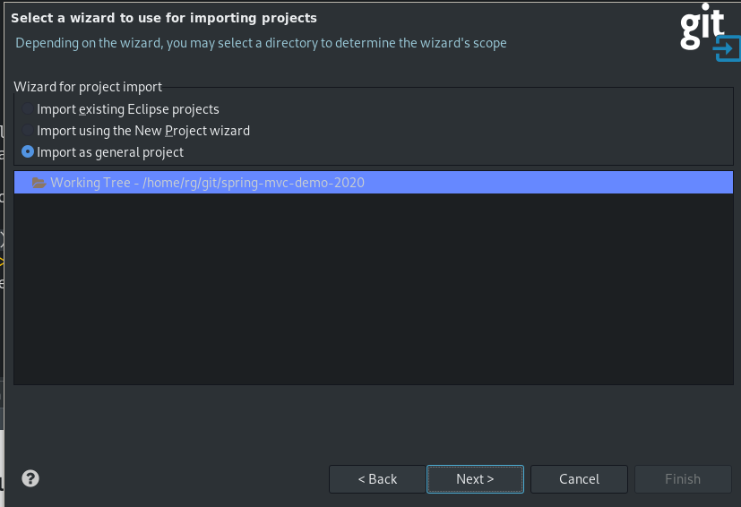


Next, you should convert the current project to Dynamic Web project.
To accomplish this, you should right-click the project and in properties go to *Project Facets*
Enable Faceted Project

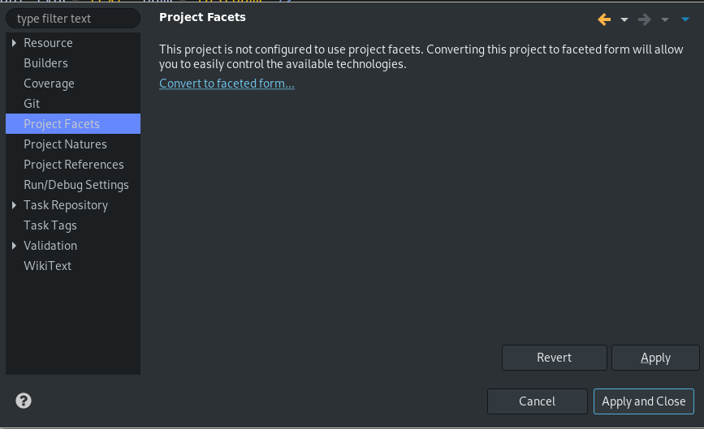

and select _Dynamic Web Module_ from the facets list.

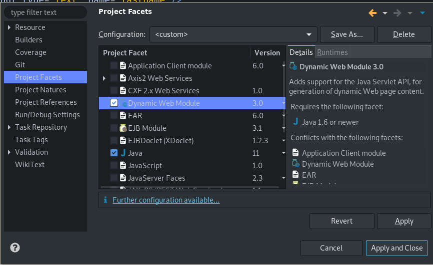

Set the default JRE runtime to be Java 11. To accomplish this, right click the project and in _Java Build Path_, in Libraries Tab edit the _JRE System Library_ to point to your Java 11 runtime (setting the appropriate value to Alternate JRE).

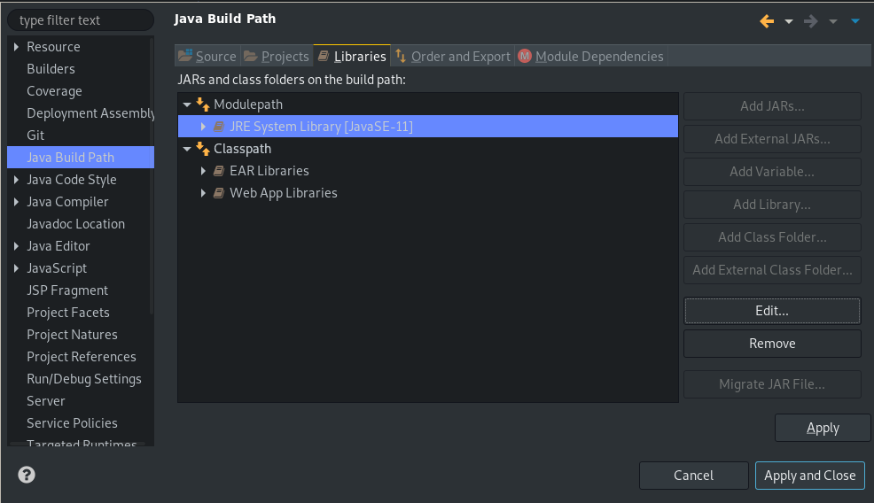

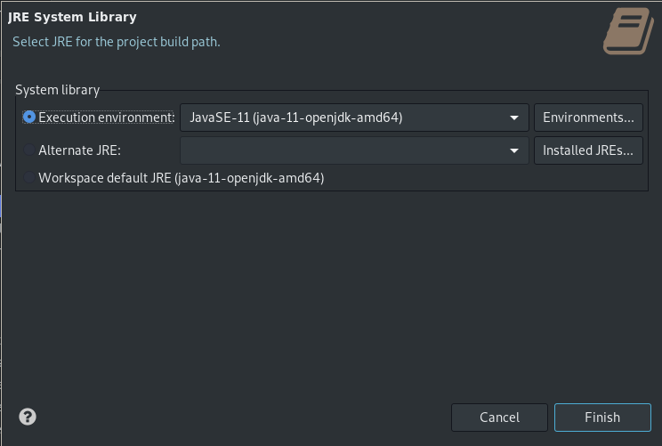


To fix the errors in jsp files, you should again right click the project, and in properties go to _Targeted Runtimes_ and select the Apache Tomcat that is connected to your eclipse workspace.

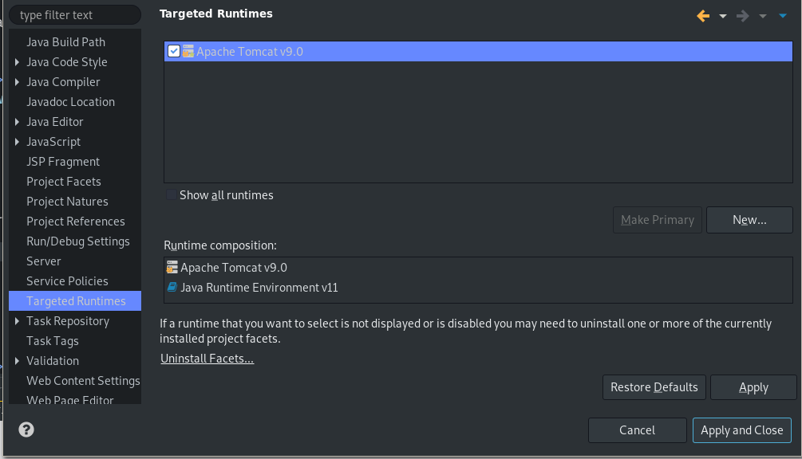

Also, don't forget to convert the project to maven project (Configure->Convert to Maven Project) and select Maven--> Update Project from the menu appearing when right-clicking the project.

## Clone Project in IntelliJ

### Configure IntelliJ to use local Tomcat

Select Run &rarr; Edit Configurations, Then the plus (+) symbol and select Tomcat Server &rarr; Local.
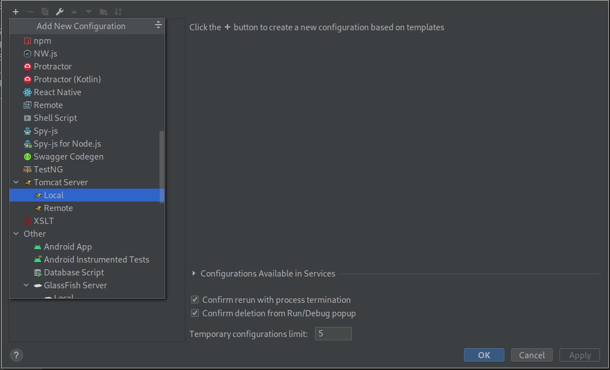
Set the location and then press the "fix" button 

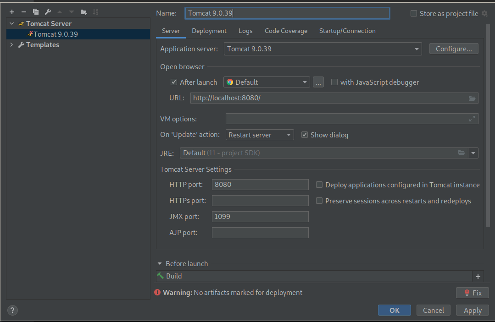

and select an artifact to deploy.
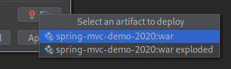

### Fix ``cannot resolve import javax.servlet.*``

Go to File &rarr; Project Structure 
Select Modules &rarr; [your module name] &rarr; Dependencies and click the plus symbol (+)

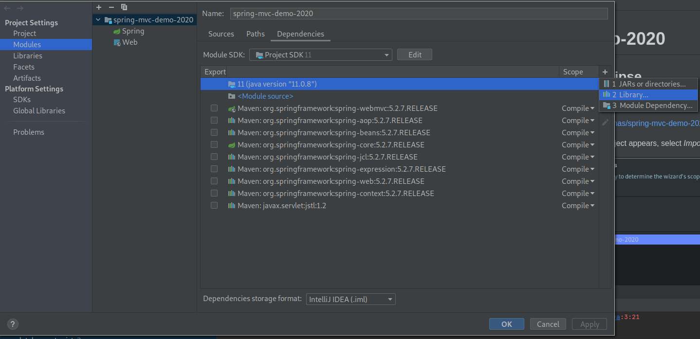
and select "Application Server Libraries &rarr; Tomcat X.X.X"
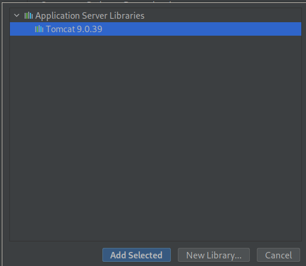

### Application properties
Change application.properties file properties based on your settings
```bash

jdbc.url=jdbc:mysql://SERVER:PORT/DATABASE?useSSL=false&allowPublicKeyRetrieval=true
jdbc.user=USERNAME
jdbc.password=PASSWORD
jdbc.driver=com.mysql.cj.jdbc.Driver

hibernate.dialect=org.hibernate.dialect.MySQLDialect
hibernate.show_sql=true
```
Change /spring-mvc-demo-2020/src/hibernate.cfg.xml file properties based on your settings
```
<!DOCTYPE hibernate-configuration PUBLIC
           "-//Hibernate/Hibernate Configuration DTD 3.0//EN"
           "http://www.hibernate.org/dtd/hibernate-configuration-3.0.dtd">

<hibernate-configuration>

   <session-factory>

           <!-- JDBC Database connection settings -->
           <property name="connection.driver_class">com.mysql.jdbc.Driver</property>
           <property name="connection.url">jdbc:mysql://SERVER:PORT/DATABASE/test?useSSL=false</property>
           <property name="connection.username">USERNAME</property>
           <property name="connection.password">PASSWORD</property>

           <!-- JDBC connection pool settings ... using built-in test pool -->
           <property name="connection.pool_size">1</property>

           <!-- Select our SQL dialect -->
           <property name="dialect">org.hibernate.dialect.MySQLDialect</property>

           <!-- Echo the SQL to stdout -->
           <property name="show_sql">true</property>

           <!-- Set the current session context -->
           <property name="current_session_context_class">thread</property>

       <!-- Set utf8 encoding -->
           <property name="hibernate.connection.CharSet">utf8</property>
           <property name="hibernate.connection.characterEncoding">utf8</property>
           <property name="hibernate.connection.useUnicode">true</property>

   </session-factory>

</hibernate-configuration>
```


## Links
* [Maven]: [Setting the -source and -target of the Java Compiler](https://maven.apache.org/plugins/maven-compiler-plugin/examples/set-compiler-source-and-target.html)
* [IntelliJ]: [Error:java: release version 5 not supported](https://dev.to/techgirl1908/intellij-error-java-release-version-5-not-supported-376)
* [IntelliJ]: [IntelliJ IDEA cannot resolve import javax.servlet.*;](https://stackoverflow.com/questions/25589152/intellij-idea-cannot-resolve-import-javax-servlet)
* [IntelliJ]: [How to add Resources Folder, Properties at Runtime into IntelliJ classpath? Adding Property files to Classpath](https://crunchify.com/how-to-add-resources-folder-properties-at-runtime-into-intellijs-classpath-adding-property-files-to-classpath/)
* [git]: [What is git tag, How to create tags & How to checkout git remote tag(s)](https://stackoverflow.com/questions/35979642/what-is-git-tag-how-to-create-tags-how-to-checkout-git-remote-tags)
